# AI Workshop

Vom _Grundwissen_ zum fertigen MVP

---

Für Nicht-Techniker geeignet.

---

<!-- markdownlint-disable MD032 MD033 MD034 -->

## Agenda

<div class="mvp-compare">
  <div>
    <h3>Teil 1</h3>
    <ol>
      <li>AI Grundwissen <small>15 min</small></li>
      <li>Tools vorstellen <small>10 min</small></li>
      <li>Tools installieren <small>30 min</small></li>
      <li>Grundlagen eines MVPs <small>20 min</small></li>
    </ol>
  </div>
  <div>
    <h3>Teil 2</h3>
    <ol start="5">
      <li>Vorstellen Beispiel MVP <small>5 min</small></li>
      <li>Umsetzung des Beispiel-MVPs <small>1:00h</small></li>
      <li>Wrap-Up <small>10 min</small></li>
    </ol>
  </div>
</div>

> Dazwischen: Pause.

---

## 1. AI Grundwissen

<div class="mvp-section-title">
  <p>Wie funktioniert das,<br>was wir täglich benutzen?</p>
</div>

---

### _Alle_ Akteure im Überblick

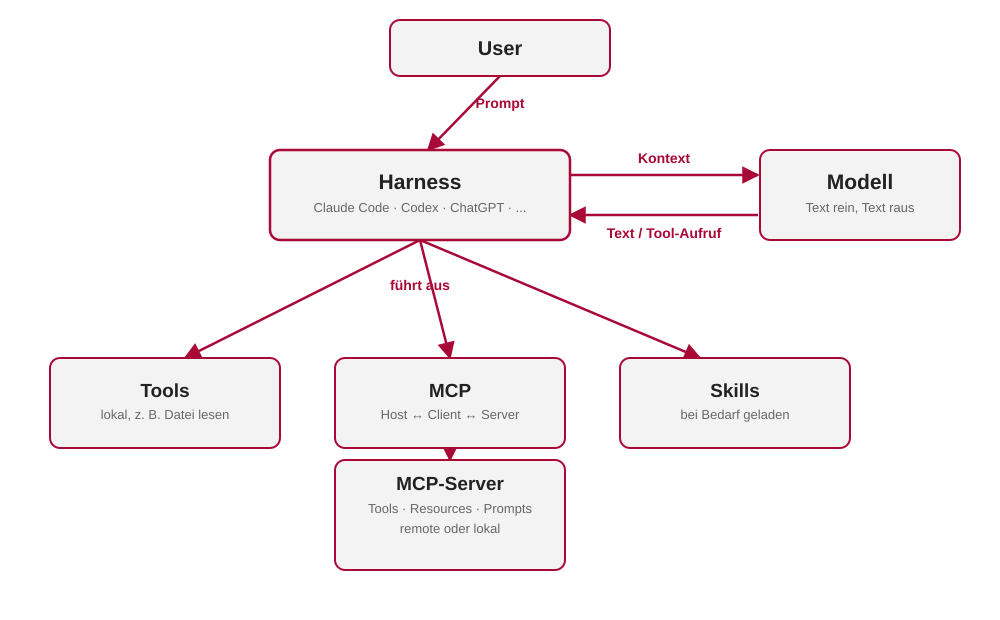

---

### Was ist ein Modell

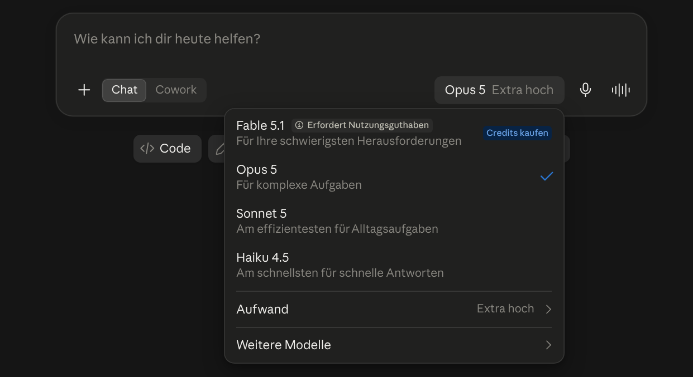

---

### Ein Model ist _wie_ eine Funtion

<p><strong>Text</strong> &rarr; <strong>[Modell]</strong> &rarr; <strong>Text</strong></p>

<div class="mvp-formula">
  <small>Black Box</small>
  <p>Was dazwischen passiert, bleibt nach außen unsichtbar.</p>
</div>

---

### Zustandslos

<div class="mvp-formula">
  <small>Jede Anfrage startet bei null</small>
  <p>Kein eingebautes Gedächtnis zwischen Aufrufen – der komplette Verlauf wird jedes Mal erneut mitgeschickt.</p>
</div>

> "Memory"-Funktionen simulieren das nur von außen.

---

### Nicht deterministisch

<div class="mvp-formula">
  <small>Wahrscheinlichkeitsverteilung statt Formel</small>
  <p>Gleiche Frage &rarr; leicht andere Antwort möglich.</p>
</div>

> Halluzination ist kein Bug – gleiche Mechanik wie eine richtige Antwort.

---

### Woher weiß das Modell etwas?

<div class="mvp-compare">
  <div>
    <h3>Trainingsdaten</h3>
    <p>Eingefroren in den Gewichten</p>
  </div>
  <div>
    <h3>Kontext</h3>
    <p class="mvp-success">Alles, was gerade mitgeschickt wird</p>
  </div>
</div>

> Werkzeuge/MCP sind kein dritter Kanal – sie befüllen nur den Kontext.

---

### Tokens

<div class="mvp-formula">
  <small>Kein Wort, sondern ein Wortstück</small>
  <p>Grundlage für Kosten, Limits und Geschwindigkeit.</p>
</div>

Beispiel: <https://platform.openai.com/tokenizer>

---

### Konsequenz: Warum Tokens zählen

<div class="mvp-formula">
  <small>Kontext-Budget ist nicht gratis</small>
  <p>Mehr Tokens = höhere Kosten, mehr Latenz – und ab einer gewissen Länge oft schlechtere Antwortqualität.</p>
</div>

> Kontext bewusst klein halten, nicht "sicherheitshalber" alles reinpacken.

---

### Der Kontext

<div class="mvp-formula">
  <small>Ein gemeinsames, begrenztes Budget</small>
  <p>System-Prompt, Tool-Beschreibungen, Verlauf, Werkzeug-Ergebnisse – alles teilt sich denselben Platz.</p>
</div>

> Alles, was das Modell bei einer Anfrage "sieht".

---

### Was ist der "Harness"?

<div class="mvp-formula">
  <small>Claude Code · Codex · ChatGPT · Claude Desktop · ...</small>
  <p>Die Anwendung rund um das Modell: ruft es auf, verwaltet den Kontext, führt Werkzeuge aus.</p>
</div>

> Das Modell selbst "weiß" davon nichts – für das Modell ist alles nur Text im Kontext.

---

### Der Agentic Loop

<ol class="mvp-contract mvp-contract-lg">
  <li>Harness schickt Kontext an das Modell</li>
  <li>Modell antwortet: Text <strong>oder</strong> Werkzeug-Aufruf</li>
  <li>Harness führt den Aufruf aus</li>
  <li>Ergebnis kommt zurück in den Kontext</li>
  <li>Wiederholen, bis das Modell fertig ist</li>
</ol>

---

### Werkzeuge (Tools)

<div class="mvp-compare">
  <div>
    <h3>Modell</h3>
    <p>fordert nur an</p>
  </div>
  <div>
    <h3>Harness</h3>
    <p class="mvp-success">führt aus (Datei lesen, Befehl ausführen, ...)</p>
  </div>
</div>

> Ein Tool ist nur Name + Beschreibung + Schema – als Text im Kontext.

---

### MCP – Model Context Protocol

<div class="mvp-acronym">
  <div><strong>M</strong><span>Model</span><small>das LLM</small></div>
  <div><strong>C</strong><span>Context</span><small>was es sieht</small></div>
  <div><strong>P</strong><span>Protocol</span><small>gemeinsamer Standard</small></div>
</div>

> Standard, um externe Werkzeuge/Daten anzubinden – remote oder lokal, der Harness ist der Client.

---

### MCP-Server

<div class="mvp-decisions">
  <div>
    <h3>Tools</h3>
    <p>Ausführbare Funktionen<br>z. B. "GitHub Issue erstellen"</p>
  </div>
  <div>
    <h3>Resources</h3>
    <p>Daten zum Referenzieren<br>Dateien, DB-Einträge, Docs</p>
  </div>
  <div>
    <h3>Prompts</h3>
    <p>Vorgefertigte Vorlagen<br>und Workflows</p>
  </div>
</div>

---

### Skills, Plugins, MCP – wer macht was?

<div class="mvp-decisions">
  <div>
    <h3>Skill</h3>
    <p>Anleitung, bei Bedarf nachgeladen</p>
  </div>
  <div>
    <h3>MCP</h3>
    <p>Externe Fähigkeit/Datenquelle<br>(eigener Server)</p>
  </div>
  <div>
    <h3>Plugin</h3>
    <p>Bündel aus beidem –<br>reines Verpackungskonzept</p>
  </div>
</div>

---

### Konsequenz: Scope entscheidet

<div class="mvp-compare">
  <div>
    <h3>MCP-Server</h3>
    <p>Jedes Tool kostet Kontext<br>Global = immer aktiv, egal ob gebraucht</p>
  </div>
  <div>
    <h3>Skills</h3>
    <p class="mvp-success">Kostenarm<br>Werden nur bei Bedarf geladen</p>
  </div>
</div>

> Server pro Projekt/Task aktivieren statt alles global anzuschalten.

---

### Werkzeug-Ergebnisse sind Daten, keine Befehle

<div class="mvp-formula">
  <small>Alles landet im gleichen Kontext</small>
  <p>Das Modell kann Daten nicht strukturell von echten Anweisungen unterscheiden.</p>
</div>

> Wichtig, sobald Werkzeuge/MCP externe oder fremde Inhalte lesen.

---

### Konsequenz: Prompt Injection

<div class="mvp-formula">
  <small>Fremder Inhalt kann wie eine Anweisung aussehen</small>
  <p>Eine Webseite, ein Issue oder eine Datei – liest ein Tool sie ein, landet der Text im Kontext und das Modell kann darauf "hören".</p>
</div>

> Bei externen/fremden Inhalten besonders vorsichtig mit Tool-Rechten sein.

---

### Bonus: Agenten, die Agenten rufen

<div class="mvp-formula">
  <small>Derselbe Loop – nur verschachtelt</small>
  <p>Ein Subagent bekommt einen eigenen, sauberen Kontext, z. B. für Recherche oder Suche.</p>
</div>

> Kostet mehr Tokens, spart aber Fokus oder Zeit (parallel).

---

### Recap: _Alle_ Akteure


---

## 2. Tools vorstellen

<div class="mvp-section-title">
  <p>Zwei Werkzeuge,<br>die den Unterschied machen</p>
</div>

---

### Context7

<div class="mvp-formula">
  <small>MCP-Server für aktuelle Doku</small>
  <p>Verhindert Antworten auf Basis veralteter Trainingsdaten (z. B. alte API-Syntax).</p>
</div>

> Einfach im Prompt anfragen, z. B. "use context7".

---

### Openspec

<div class="mvp-formula">
  <small>Spec-driven Workflow</small>
  <p>Erst Spec schreiben, dann Code – Scope und Vorgehen liegen vorher schriftlich fest, nicht nur im Kopf des Modells.</p>
</div>

> Schützt vor Scope-Wachstum und "stillem" Umplanen mitten in der Umsetzung.

---

### Warum Openspec?

<div class="mvp-decisions">
  <div>
    <h3>Billig vor teuer</h3>
    <p>Falsche Spec korrigieren ist günstiger als falschen Code</p>
  </div>
  <div>
    <h3>Kein Scope-Creep</h3>
    <p>Requirements stehen fest, bevor implementiert wird</p>
  </div>
  <div>
    <h3>Übersteht Kontext-Reset</h3>
    <p>Spec bleibt, auch wenn Session/Kontext verloren geht</p>
  </div>
</div>

---

### Warum Openspec? (2)

<div class="mvp-decisions">
  <div>
    <h3>Review vor Code</h3>
    <p>Die Spec lässt sich absegnen, bevor das Modell loslegt</p>
  </div>
  <div>
    <h3>Nachvollziehbar</h3>
    <p>Archivierte Specs dokumentieren, was warum geändert wurde</p>
  </div>
  <div>
    <h3>Teamfähig</h3>
    <p>Alle arbeiten gegen dieselbe Spec, nicht gegen eigene Annahmen</p>
  </div>
</div>

---

### Openspec – die vier Phasen

<ol class="mvp-contract">
  <li><code>explore</code> – Ist-Zustand verstehen, Optionen abwägen, Anforderungen erarbeiten</li>
  <li><code>propose</code> – konkreten Change als Spec vorschlagen</li>
  <li><code>apply</code> – Spec Schritt für Schritt umsetzen</li>
  <li><code>archive</code> – abgeschlossene Spec archivieren, in Haupt-Spec mergen</li>
</ol>

---

### Initialsierung

```sh
cd mein-neues-repo

openspec init
```

---

### Initialsierung (2)

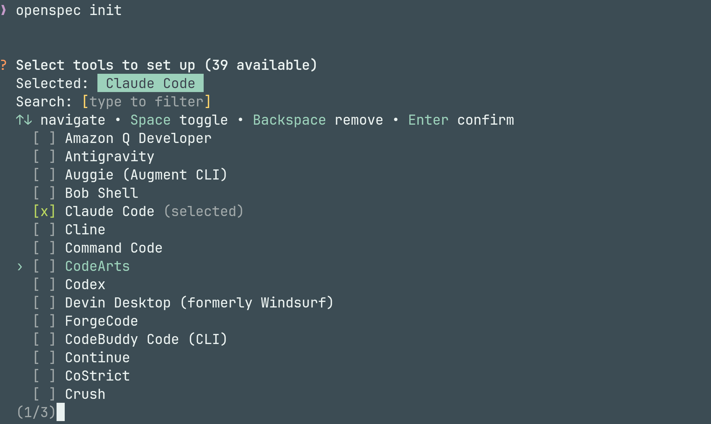

---

### Initialsierung (3)

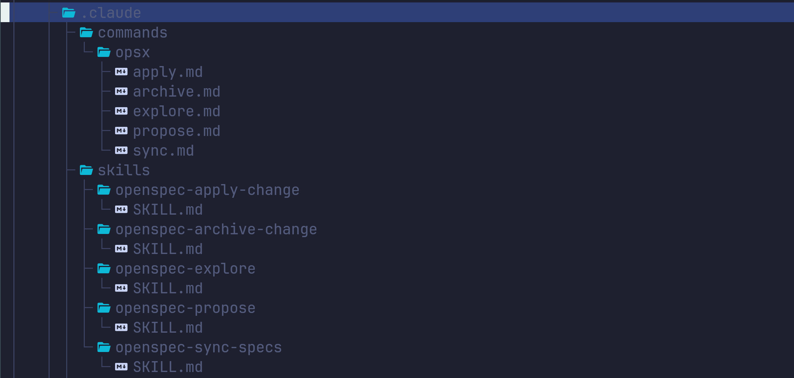

---

### Explore

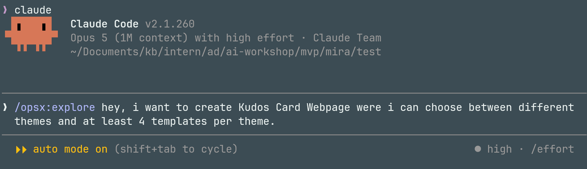

---

### Explore (2)

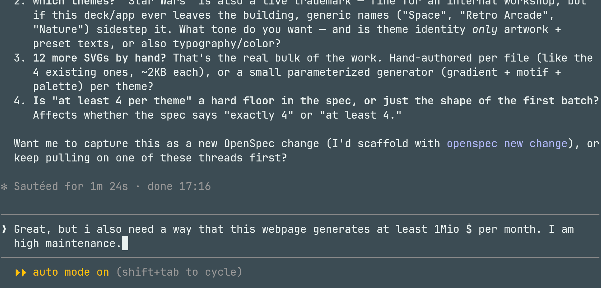

---

### Propose

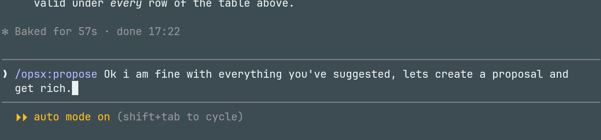

---

### Propose (2)

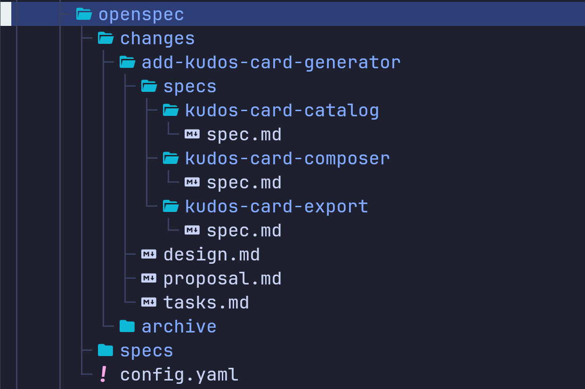

---

### Apply

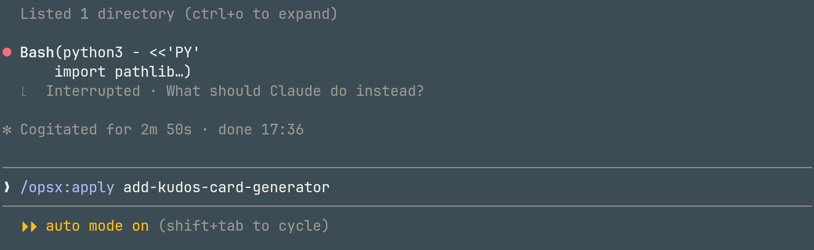

---

### Tasks

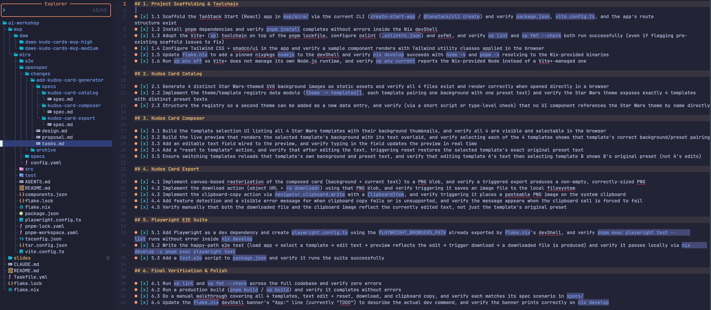

---

### Archive

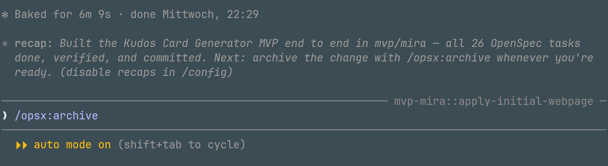

---

### Archive (2)

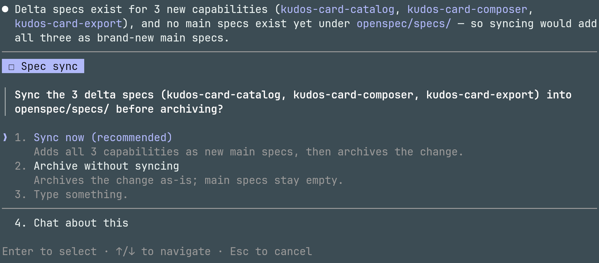

---

### Archive (3)

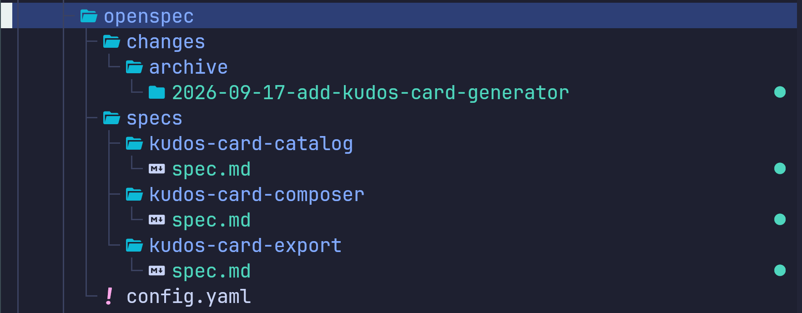

---

### Welches Model für welchen Skill

<div class="mvp-decisions">
  <div>
    <h3>explore / propose</h3>
    <p>high effort<br>Codex: Sol/Terra<br>Claude: Opus high</p>
  </div>
  <div>
    <h3>apply</h3>
    <p>medium effort<br>Codex: Terra<br>Claude: Sonnet high ??</p>
  </div>
  <div>
    <h3>archive</h3>
    <p>medium effort<br>Codex: Terra<br>Claude: Sonnet medium</p>
  </div>
</div>

---

## 3. Tools installieren

<div class="mvp-section-title">
  <p>Schritt für Schritt<br>startklar machen</p>
</div>

---

<!-- markdownlint-disable MD024 -->

### Context7

<div class="mvp-formula">
  <small>Installation</small>
  <p><a href="https://github.com/upstash/context7#installation">github.com/upstash/context7#installation</a></p>
</div>

---

### Openspec

<div class="mvp-formula">
  <small>Installation</small>
  <p><a href="https://openspec.dev/docs/installation">openspec.dev/docs/installation</a></p>
</div>

---

<!-- markdownlint-enable MD024 -->

## 4. Grundlagen eines MVPs

<div class="mvp-section-title">
  <p>Von der Produktidee zur kleinsten<br>demonstrierbaren Kernreise</p>
</div>

<aside class="notes">
Stichpunkte zum Scannen:

- Tools sind bereit, jetzt geht es um den richtigen Zuschnitt
- Leitfrage: Idee bis zu einer funktionierenden Kernreise verkleinern
- Rahmen: lokal lauffähig und live demonstrierbar, kein Deployment
- Übergang: zwei mögliche Hackathon-Ergebnisse vergleichen

Wir haben jetzt die Tools gesehen und eingerichtet. Bevor wir damit losbauen, möchte ich kurz über den Zuschnitt sprechen. Denn AI hilft uns dabei, schneller zu bauen. Sie verhindert aber nicht, dass wir das Falsche oder einfach viel zu viel bauen.

Die Frage für die nächsten Minuten ist deshalb: Wie schneiden wir eine Produktidee so klein, dass am Ende des Hackathons eine funktionierende Kernreise steht?

Es geht hier um eine konkrete Arbeitsweise für diesen Hackathon. Am Ende muss das Produkt lokal laufen und live demonstrierbar sein. Deployment gehört nicht zum MVP.

Übergang: Schauen wir uns dafür erst mal zwei mögliche Hackathon-Ergebnisse an.

[Sources]
- https://klosebrothers.atlassian.net/wiki/spaces/KB/pages/2993422337/Hackathon
</aside>

---

## Ein MVP ist ein Beweis

<div class="mvp-compare">
  <div>
    <h3>Team "Fleißig"</h3>
    <p>Viele Bausteine</p>
    <p class="mvp-muted">Kein kompletter Weg</p>
  </div>
  <div>
    <h3>Team "Smart"</h3>
    <p>Ein Happy Path</p>
    <p class="mvp-success">Nutzen sichtbar</p>
  </div>
</div>

> Ein vollständiger Happy-Path schlägt fünf halbfertige Features.

<aside class="notes">
Stichpunkte zum Scannen:

- Team „Fleißig“: viele Bausteine, aber kein Weg zum Ergebnis
- Team „Smart“: wenig Umfang, aber ein vollständiger Ablauf
- Für den Hackathon gewinnt Team „Smart“
- Nutzen zeigen, Nutzer testen lassen, Produkt-Feedback bekommen
- MVP als Beweis: eine Person erreicht ein relevantes Ergebnis
- Übergang: alle drei Buchstaben von MVP müssen stimmen

Stellt euch zwei Teams vor. Team "Fleißig" hat richtig viel gebaut: Login, Rollen, Datenbank, vielleicht sogar schon ein Dashboard. Alles sieht nach Fortschritt aus. Aber wenn ein Nutzer vor der Anwendung sitzt, kommt er noch nicht von einem Startpunkt zu einem brauchbaren Ergebnis.

Team Smart hat deutlich weniger. Vielleicht gibt es nur einen Testnutzer. Vielleicht sind Daten hardgecoded. Das Design ist noch nicht besonders schön. Aber ein kompletter Weg funktioniert.

Für den Hackathon hat Team "Smart" das bessere MVP.

Team "Smart" kann den versprochenen Nutzen zeigen. Ein echter Nutzer könnte den Ablauf testen. Und wir bekommen Feedback zum Produkt, nicht nur zur Technik.

Ein MVP ist für mich deshalb kein kleines fertiges Produkt. Es ist ein Beweis.
Wir beweisen, dass eine bestimmte Person mit unserer Lösung ein relevantes Ergebnis erreichen kann.

Übergang: Dafür müssen allerdings alle drei Buchstaben von MVP stimmen.

[Sources]
- https://klosebrothers.atlassian.net/wiki/spaces/KB/pages/2993422337/Hackathon
</aside>

---

## Minimum allein reicht nicht

<div class="mvp-acronym">
  <div><strong>M</strong><span>Minimum</span><small>minimal</small></div>
  <div><strong>V</strong><span>Viable</span><small>nutzbar</small></div>
  <div><strong>P</strong><span>Product</span><small>Produkt</small></div>
</div>

> Die kleinste Lösung, die echten Nutzen beweist.

<aside class="notes">
Stichpunkte zum Scannen:

- Nicht nur klein bauen: „M“ allein reicht nicht
- Minimum: nur, was der Beweis braucht
- Viable: echter Nutzen trotz kleinem Umfang
- Product: konkretes Problem für eine konkrete Person lösen
- Chat, API oder Dashboard allein sind noch kein Produkt
- Wirtschaftliche Seite: Zielkunde, Zahlungsbereitschaft, Einnahmekanal
- Übergang: zuerst den Wertmoment bestimmen

Beim MVP schauen viele zuerst auf das M: möglichst klein, möglichst wenig Aufwand. Das ist verständlich, aber allein noch nicht genug. Das verträgt sich gut mit dem agilen Prinzip "Maximizing the work not done".

Minimum heißt: Wir bauen nur das, was wir für den Beweis brauchen.

Viable heißt: Trotz des kleinen Umfangs entsteht ein echter Nutzen.

Product heißt: Dieser Nutzen entsteht für eine konkrete Person mit einem konkreten Problem.

Ein Chatfenster mit einem Modell dahinter ist noch kein Produkt. Eine API ist noch kein Produkt. Auch ein schickes Dashboard ist noch kein Produkt. Das Produkt beginnt dort, wo für jemanden ein Problem besser gelöst wird.

Für den Hackathon kommt die wirtschaftliche Seite dazu: Wer ist der Zielkunde? Wer könnte bezahlen? Welcher Einnahmekanal wäre denkbar? Wir müssen die Bezahlung noch nicht implementieren. Aber wir sollten erklären können, warum jemand dafür bezahlen könnte.

Übergang: Um das herauszufinden, starten wir nicht bei den Features, sondern beim Wertmoment.

[Sources]
- https://klosebrothers.atlassian.net/wiki/spaces/KB/pages/2993422337/Hackathon
- https://github.com/klosebrothers/hackathon/blob/main/prompts/EXISTIERENDEIDEE.md
</aside>

---

## Der Wertmoment

<p><strong>[Kunde]</strong> &rarr; <strong>[Aktion]</strong> &rarr; <strong>[sichtbares Resultat]</strong></p>

<div class="mvp-formula">
  <small>Beispiel: Kudo Card</small>
  <p>Eine Kollegin erstellt aus drei Stichpunkten eine persönliche Kudos-Karte und teilt sie direkt.</p>
</div>

> Welcher Moment **beweist** den Nutzen?

<aside class="notes">
Stichpunkte zum Scannen:

- Formel: Nutzer tut etwas und erhält ein sichtbares Ergebnis
- Kudos-Beispiel: Karte erstellen und direkt teilen
- Wert liegt in der fertigen Karte, nicht in Website oder AI
- Leitfragen: Was besitzt der Nutzer neu, was macht Nutzen sofort sichtbar?
- Erst danach Features auswählen
- Übergang: kleinsten Weg bis zum Wertmoment bauen

Bevor wir über Screens, Datenbanken oder Frameworks sprechen, sollten wir einen einfachen Satz vervollständigen können: Ein bestimmter Nutzer tut etwas und erhält ein sichtbares Ergebnis.

Für das Beispiel mit der Kudo Card könnte das heißen: Eine Kollegin möchte jemandem Anerkennung geben. Sie erstellt eine persönliche Karte und kann sie direkt teilen.

Der Wertmoment ist nicht, dass sie die Website geöffnet hat. Er ist auch nicht, dass irgendwo AI verwendet wurde. Der Wertmoment ist die fertige Karte, die sie tatsächlich verschicken kann.

Hilfreiche Fragen: Was sieht oder besitzt der Nutzer am Ende, was er vorher nicht hatte? Welcher Moment macht den Nutzen sofort verständlich?

Erst wenn der Wertmoment klar ist, sollten wir Features auswählen.

Übergang: Jetzt müssen wir einen möglichst kleinen Weg bis zu diesem Moment bauen.

[Sources]
- https://github.com/klosebrothers/hackathon/blob/main/prompts/IDEENSUCHE.md
- https://github.com/klosebrothers/hackathon/blob/main/prompts/EXISTIERENDEIDEE.md
</aside>

---

## Kernreise bauen, nicht Schichten

<div class="mvp-scope-visual">
  <div class="mvp-scope-option">
    <h3>Schichten</h3>
    <div class="mvp-layer-stack"><span>UI</span><span>API</span><span>Datenbank</span></div>
    <p>Viel angefangen.<br>Nichts erlebbar.</p>
  </div>
  <div class="mvp-scope-arrow">→</div>
  <div class="mvp-scope-option mvp-scope-option-good">
    <h3>Kernreise</h3>
    <div class="mvp-vertical-slice">
      <div class="mvp-slice-start">Start</div>
      <div class="mvp-slice-down">↓</div>
      <div class="mvp-slice-bars"><span>UI</span><span>API</span><span>DB</span></div>
      <div class="mvp-slice-down">↓</div>
      <div class="mvp-slice-result">Wertmoment</div>
    </div>
  </div>
</div>

<aside class="notes">
Zeit: etwa 3 Minuten.

Stichpunkte zum Scannen:

- Horizontal: UI, API und Datenbank angefangen, aber kein Ablauf nutzbar
- Vertikal: ein schmaler, kompletter Weg vom Start zum Ergebnis
- Vereinfachen: ein Nutzer, Happy Path, vorbereitete Daten, eine Funktion
- Kernreise maximal fünf Schritte und in vier Minuten demonstrierbar
- Ziel: ein schmaler Weg, der vollständig funktioniert
- Übergang: bauen, simulieren oder streichen entscheiden

Beim horizontalen Schnitt bauen wir Schichten. Wir haben schon ein bisschen UI, ein bisschen API und ein Datenbankschema. Jede Schicht ist vielleicht zu 70 Prozent fertig. Trotzdem kann niemand den ganzen Ablauf nutzen.

Der vertikale Schnitt geht einmal komplett durch das System. Er ist bewusst schmal, aber er reicht vom Start bis zum Ergebnis.

Das darf am Anfang sehr einfach sein: ein Nutzer statt eines vollständigen Rollenmodells, ein Happy Path statt aller Sonderfälle, vorbereitete Daten statt einer Admin-Oberfläche und eine Funktion statt einer ganzen Plattform.

Für den Hackathon sollte die Kernreise höchstens fünf Schritte haben. Wenn sie sich nicht in vier Minuten ruhig demonstrieren lässt, ist sie wahrscheinlich noch zu groß.

Ein schmaler Weg, der komplett funktioniert, ist unser Ziel.

Übergang: Damit kommen wir zu der unangenehmen Frage: Was bauen wir wirklich und was nicht?

[Sources]
- https://klosebrothers.atlassian.net/wiki/spaces/KB/pages/2993422337/Hackathon
- https://github.com/klosebrothers/hackathon/blob/main/templates/IDEENEINREICHUNG.md
</aside>

---

## Bauen, simulieren oder streichen

<div class="mvp-decisions">
  <div>
    <h3>Bauen</h3>
    <p>Kartentext erzeugen<br>Karte teilen</p>
  </div>
  <div>
    <h3>Simulieren</h3>
    <p>Fester Testnutzer<br>Beispieldaten<br>Externe Integration mocken</p>
  </div>
  <div>
    <h3>Streichen</h3>
    <p>Rollen &amp; Rechte<br>Admin-Bereich<br>Onboarding<br>Sonderfälle</p>
  </div>
</div>

> Den Kernnutzen niemals simulieren.

<aside class="notes">
Zeit: etwa 3 Minuten.

Stichpunkte zum Scannen:

- Jedes Feature: bauen, simulieren oder streichen
- Bauen: Kernnutzen, USP und technisch riskante Stelle
- Simulieren: Testnutzer, Beispieldaten, gemocktes Teilen
- Manuelle Administration hinterlegen statt Verwaltungsoberfläche bauen
- Streichen: Rollen, Settings, Onboarding und Sonderfälle
- Manuelle Schritte sind okay, wenn sie offen benannt werden
- Infrastruktur simulieren, den versprochenen Nutzen niemals vortäuschen
- Übergang: klare Fertig-Kriterien festlegen

Für jedes Feature gibt es drei mögliche Entscheidungen. Wir können es bauen, wir können es simulieren oder wir können es streichen.

Bauen sollten wir den Kernnutzen, den USP und eine technisch riskante Stelle, ohne die der Produktbeweis nicht funktioniert.

**Simulieren** können wir austauschbare Infrastruktur. Zum Beispiel: Statt eines Logins startet die Demo immer als „Lea aus dem Marketing“. Statt eines Imports liegen drei passende Beispiel-Kudos bereits bereit. Und statt die Teams- oder Slack-Integration wirklich anzubinden, zeigt der Teilen-Button eine Erfolgsmeldung und kopiert den Link in die Zwischenablage.

Auch eine manuelle Administration ist erlaubt: Wenn sich die Liste der Kolleginnen und Kollegen im MVP noch nicht selbst verwalten lässt, hinterlegt das Team sie vor der Demo einmalig in einer Datei oder Datenbank.

Streichen können wir Rollen, Settings, vollständiges Onboarding, Sonderfälle und alles, was nur „wäre cool“ ist.

Manuelle Schritte hinter den Kulissen sind okay, wenn wir sie offen benennen. Was wir nicht machen sollten: den eigentlichen Kernnutzen vortäuschen.

Infrastruktur dürfen wir simulieren. Den versprochenen Nutzen nicht.

Übergang: Wenn wir so schneiden, brauchen wir noch eine klare Antwort darauf, wann wir fertig sind.

[Sources]
- https://github.com/klosebrothers/hackathon/blob/main/prompts/EXISTIERENDEIDEE.md
- https://klosebrothers.atlassian.net/wiki/spaces/KB/pages/2993422337/Hackathon
</aside>

---

## Wann ist das MVP fertig?

<div class="mvp-done">
  <p>✓ Kernreise funktioniert</p>
  <p>✓ Nutzen ist sichtbar</p>
  <p>✓ Lokal startbar und demonstrierbar</p>
  <p>✓ Produktiv deploybar – ohne grundlegenden Umbau</p>
</div>

<aside class="notes">
Zeit: etwa 2 Minuten.

Stichpunkte zum Scannen:

- Technische Tätigkeiten sind keine Fertig-Kriterien
- Beobachtbar: Kernreise läuft selbstständig, Nutzen sichtbar, lokal startbar, Demo passt
- Drei bis fünf Kriterien reichen, wenn sie eindeutig sind
- Produktiv deploybar ohne Umbau, kleine Ergänzungen bleiben erlaubt
- Übergang: diese Entscheidungen im MVP-Vertrag festhalten

Frontend fertig, Backend angebunden oder AI funktioniert sind keine guten Fertig-Kriterien. Das sind technische Tätigkeiten. Sie sagen noch nichts darüber aus, ob der Nutzer sein Ziel erreicht.

Gute Kriterien kann jemand beobachten und überprüfen: Die Kernreise läuft ohne Eingriff eines Entwicklers. Am Ende ist der versprochene Nutzen sichtbar. Das Projekt lässt sich mit einem dokumentierten Befehl lokal starten. Und der komplette Weg passt in die vierminütige Live-Demo.

Deployment selbst gehört ausdrücklich nicht zum Hackathon. Das MVP sollte aber ohne grundlegenden Umbau produktiv deploybar sein. Kleine Ergänzungen sind völlig okay: zum Beispiel Single Sign-On, Secrets, Monitoring oder eine Deployment-Konfiguration. Nicht okay wäre, wenn wir die Kernlogik oder Architektur dafür neu bauen müssten.

Übergang: Diese sechs Fragen halten wir jetzt kurz fest.

[Sources]
- https://klosebrothers.atlassian.net/wiki/spaces/KB/pages/2993422337/Hackathon
- https://github.com/klosebrothers/hackathon/blob/main/templates/IDEENEINREICHUNG.md
</aside>

---

## Sechs Fragen vor der ersten Code-Zeile

<ol class="mvp-contract">
  <li>Für wen bauen wir?</li>
  <li>Welches Problem lösen wir?</li>
  <li>Welches Ergebnis beweist den Nutzen?</li>
  <li>Welche maximal fünf Schritte führen dorthin?</li>
  <li>Woran erkennen wir, dass das MVP fertig ist?</li>
  <li>Was bauen wir bewusst nicht?</li>
</ol>

> Erst klären. Dann bauen.

<aside class="notes">
Zeit: etwa 3 Minuten.

Stichpunkte zum Scannen:

- Vor dem Bauen müssen sechs Fragen beantwortet sein
- Zielkunde, Problem, Wertmoment, Kernreise, Fertig-Kriterien, Nicht-Ziele
- Unklare Idee zuerst weiter verkleinern
- Reihenfolge: erst klären, dann bauen
- Antworten als Grundlage für Spec, Scope-Schutz und Live-Demo
- Fertig-Kriterien beschreiben überprüfbare Ergebnisse, keine Tätigkeiten
- Nicht-Ziele verhindern Scope-Wachstum und gehören in die Einreichung
- Übergang: die sechs Fragen am Beispiel ansehen

Bevor am Hackathon-Tag gebaut wird, sollten diese sechs Fragen beantwortet sein.

Erstens: Für welchen Zielkunden bauen wir? Zweitens: Welche konkrete Problemsituation verbessern wir? Drittens: Welches sichtbare Ergebnis beweist den Nutzen? Viertens: Welche maximal fünf Schritte führen dorthin? Fünftens: Woran erkennen wir objektiv, dass das MVP funktioniert? Sechstens: Was lassen wir bewusst weg?

Wenn eine dieser Fragen unklar ist, sollten wir nicht einfach anfangen und hoffen, dass sie sich beim Coden ergibt. Dann schneiden wir die Idee zuerst nochmal kleiner.

Erst schneiden. Dann bauen.

Die Antworten auf diese sechs Fragen sind anschließend die Grundlage für die Spec, schützen vor spontanem Scope-Wachstum und geben uns die Struktur für die Live-Demo.

Die Fertig-Kriterien beschreiben überprüfbare Ergebnisse, keine erledigten technischen Aufgaben. Zum Beispiel: Eine Kudos-Karte lässt sich aus drei Stichpunkten erzeugen, bearbeiten und teilen. „Frontend fertig“ wäre dagegen kein gutes Kriterium.

Nicht-Ziele sind nicht für jedes MVP der Welt zwingend. Für diesen eintägigen Hackathon würde ich sie aber verbindlich machen. Sie verhindern, dass Login, Rollen, Analytics oder weitere Sonderfälle am Hackathon-Tag wieder in den Scope rutschen. Außerdem verlangt die Einreichungsvorlage ausdrücklich drei bis fünf Punkte, die nicht Bestandteil des MVPs sind.

Übergang zu Teil 5: Genug Theorie. Schauen wir uns jetzt an, wie diese sechs Fragen für unser Beispiel-MVP aussehen.

[Sources]
- https://github.com/klosebrothers/hackathon/blob/main/templates/IDEENEINREICHUNG.md
- https://github.com/klosebrothers/hackathon/blob/main/prompts/EXISTIERENDEIDEE.md
</aside>

---

## Pause

> 10 Minuten

---

## 5. Vorstellen Beispiel MVP

<div class="mvp-section-title">
  <p>So könnte es aussehen</p>
</div>

---

## 6. Umsetzung eines Beispiel-MVPs

<div class="mvp-section-title">
  <p>Vom Openspec-Workflow<br>zur fertigen Kudos-Card</p>
</div>

---

### Openspec Recap

<ol class="mvp-contract mvp-contract-lg">
  <li><code>explore</code></li>
  <li><code>propose</code></li>
  <li><code>apply</code></li>
  <li><code>archive</code></li>
</ol>

---

### Eure Aufgabe: 3 Features

<div class="mvp-decisions">
  <div>
    <h3>1. Kudos-Card generieren</h3>
    <p>1 Theme mit 4 Templates<br>Adressat, Headline, Text, Icon<br>anzeigen, herunterladen, kopieren</p>
  </div>
  <div>
    <h3>2. Mehrere Themes</h3>
    <p>Mindestens zwei weitere Themes<br>mit je 4 Templates</p>
  </div>
  <div>
    <h3>3. Ascii-Theme</h3>
    <p class="mvp-muted">(optional)<br>Nur Ascii-Zeichen<br>Copy-Button</p>
  </div>
</div>

---

## 7. Wrap-Up

<div class="mvp-compare">
  <div>
    <h3>Was hat euch überrascht?</h3>
  </div>
  <div>
    <h3>Was nehmt ihr mit für den Hackathon?</h3>
  </div>
</div>
